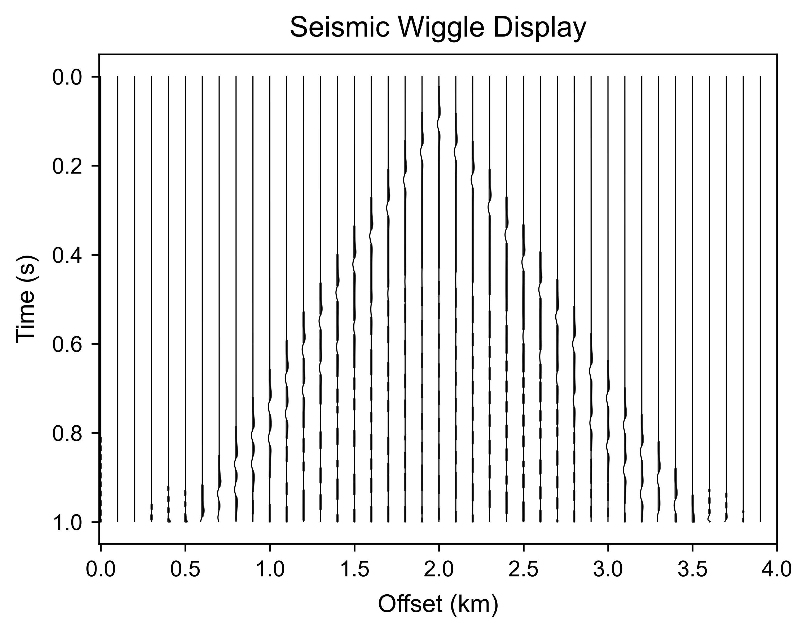

# Geophysics Forward Plotting

**Publication-grade geophysical plotting skills for AI coding agents.**

Geophysics Forward Plotting packages the plotting conventions used in seismic
forward-modeling research as portable Agent Skills and executable Python code.
It helps AI agents produce velocity models, shot records, wavefield snapshots,
method comparisons, error maps, wiggle plots, performance charts, and 3D volume
views without losing physical coordinates, units, axis direction, or shared
color normalization.

**English** | [中文](README_zh.md)




This project is built on [CIGVis](https://github.com/JintaoLee-Roger/cigvis).
CIGVis supplies the geophysical 1D, 2D, 3D, and interactive visualization
capabilities; this repository adds an upper-layer Agent/Skills framework,
forward-modeling figure conventions, task routing, review gates, and export
rules. See the [CIGVis Gallery](https://cigvis.readthedocs.io/en/latest/gallery/index.html)
for the underlying visualization capabilities.

```text
  LOAD          INSPECT         ROUTE          PLOT          REVIEW         EXPORT
 +------+      +--------+      +------+      +-------+      +------+      +--------+
 | .npy | ---> | shape  | ---> | task | ---> | skill | ---> | axes | ---> | PNG    |
 | YAML |      | units  |      | type |      | run   |      | clim |      | PDF/SVG|
 +------+      +--------+      +------+      +-------+      +------+      +--------+
```

---

## Commands

The `gfp` CLI maps directly to the plotting-agent workflow.

| What you are doing | Command | Result |
|---|---|---|
| Render a YAML task | `gfp render examples/configs/shot_record.yaml` | Figure files plus review messages |
| Inspect the execution plan | `gfp plan examples/configs/compare_4methods.yaml` | Selected skill and planned steps |
| Review a figure task | `gfp review examples/configs/wavefield_snapshot.yaml` | Convention findings without rendering |
| List executable skills | `gfp skills` | Registered Python skills |
| List portable Agent Skills | `gfp agent-skills list` | Canonical `SKILL.md` catalog |
| Validate Agent Skills | `gfp agent-skills validate` | Frontmatter and section validation |
| Install skills for AI tools | `gfp agent-skills install --tool all` | Project-local skill copies |

---

## Quick Start

<details open>
<summary><b>Conda environment (recommended)</b></summary>

```bash
cd geophysics-forward-plotting
conda env create -f environment.yml
conda activate geophysics-forward-plotting
gfp agent-skills validate
gfp render examples/configs/shot_record.yaml
```

Install the optional CIGVis runtime for 3D volume rendering and SliceViewer:

```bash
python -m pip install -e ".[cigvis]"
```

</details>

<details>
<summary><b>Existing Python 3.11+ environment</b></summary>

```bash
python -m pip install -e ".[plot,cli]"
python -m pip install -e ".[full]"  # includes CIGVis
```

</details>

<details>
<summary><b>China mirrors</b></summary>

```bash
conda create -n geophysics-forward-plotting python=3.11 \
  --override-channels \
  -c https://mirrors.tuna.tsinghua.edu.cn/anaconda/pkgs/main \
  -c https://mirrors.tuna.tsinghua.edu.cn/anaconda/cloud/conda-forge -y
conda activate geophysics-forward-plotting
python -m pip install -e ".[plot,dev]" \
  -i https://mirrors.tuna.tsinghua.edu.cn/pypi/web/simple
```

</details>

---

## AI Coding Tools

`skills/` is the canonical catalog. Each integration points the coding agent to
the same scientific rules instead of duplicating prompts per product.

Install skills into one or more project-local discovery directories:

```bash
gfp agent-skills install --tool codex claude cursor gemini copilot opencode
```

| Tool | Project entry point | Installed skill directory |
|---|---|---|
| OpenAI Codex | `AGENTS.md` | `.agents/skills/` |
| Claude Code | `CLAUDE.md` | `.claude/skills/` |
| Cursor | `.cursor/rules/` | `.cursor/skills/` |
| Gemini CLI | `GEMINI.md` | `.gemini/skills/` |
| GitHub Copilot | `.github/copilot-instructions.md` | `.github/skills/` |
| OpenCode | `AGENTS.md` | `.opencode/skills/` |
| Windsurf | `.windsurf/rules/` | Reads the canonical catalog |
| Cline | `.clinerules/` | Reads the canonical catalog |
| Roo Code | `.roo/rules/` | Reads the canonical catalog |

The installer never overwrites an existing skill unless `--force` is supplied.
Use `--destination PATH` to install this catalog into another project. See
[Agent Skills Integration](docs/agent-skills.md) for discovery behavior and the
full target matrix.

---

## All 13 Agent Skills

The catalog contains a root router, a method-evaluation orchestrator, data
inspection, nine plotting workflows, and a final figure-review gate. Agents
load the smallest relevant skill set for each request.

### Orchestrate - Route and evaluate

| Skill | What it does | Use when |
|---|---|---|
| [geophysics-forward-plotting](skills/geophysics-forward-plotting/SKILL.md) | Routes a request through inspect, plot, review, and export | Starting any geophysical plotting task |
| [method-evaluation](skills/method-evaluation/SKILL.md) | Composes comparison, residual, performance, and review workflows | Evaluating a method against reference results or baselines |

### Inspect - Understand the data

| Skill | What it does | Use when |
|---|---|---|
| [data-inspector](skills/data-inspector/SKILL.md) | Loads NumPy arrays and infers common `nt x nx`, `nz x nx`, and `nz x ny x nx` layouts | Shape, layout, physical axes, or value range is uncertain |

### Plot - Create the figure

| Skill | What it does | Use when |
|---|---|---|
| [velocity-model-plotting](skills/velocity-model-plotting/SKILL.md) | Plots velocity with distance/depth coordinates and depth increasing downward | Displaying a velocity model or monotone spatial field |
| [shot-record-plotting](skills/shot-record-plotting/SKILL.md) | Plots a shot gather with time downward and a symmetric amplitude scale | Displaying modeled or observed receiver records |
| [wavefield-snapshot-plotting](skills/wavefield-snapshot-plotting/SKILL.md) | Plots a wavefield with symmetric limits, depth downward, and optional time annotation | Inspecting pressure or displacement at one time step |
| [multi-method-comparison](skills/multi-method-comparison/SKILL.md) | Builds 2-4 aligned panels with one global color range and shared colorbar | Comparing algorithms, resolutions, or time steps |
| [wiggle-plotting](skills/wiggle-plotting/SKILL.md) | Creates wiggle/wigb displays with skip, gain, scale, and fill controls | Inspecting individual traces or a local gather window |
| [error-map-plotting](skills/error-map-plotting/SKILL.md) | Creates signed, absolute, or relative error maps with the correct color semantics | Quantifying deviations from a reference array |
| [performance-plotting](skills/performance-plotting/SKILL.md) | Creates publication-oriented runtime, memory, and speedup charts | Reporting computational benchmarks |
| [volume-3d-plotting](skills/volume-3d-plotting/SKILL.md) | Delegates 3D volume slices and overlays to CIGVis | Viewing seismic or wavefield volumes in 3D |
| [sliceviewer-plotting](skills/sliceviewer-plotting/SKILL.md) | Opens an interactive CIGVis SliceViewer for a 3D array | Exploring inline, crossline, and depth/time slices |

### Review - Enforce conventions

| Skill | What it does | Use when |
|---|---|---|
| [figure-review](skills/figure-review/SKILL.md) | Checks units, axis direction, colorbar labels, shared normalization, title length, layout, and export DPI | Before accepting or exporting any research figure |

---

## Usage

### Python API

```python
from pathlib import Path

import numpy as np

from geophysics_forward_plotting import FigureTask, PlottingAgent
from geophysics_forward_plotting.core.models import DataContext

shot = np.load("examples/data/shot_record.npy")

task = FigureTask(
    task_type="shot_record",
    title="Synthetic Shot Record",
    output_dir=Path("examples/outputs"),
    dx=0.025,
    dt=0.002,
    x_label="Receiver position (km)",
    y_label="Time (s)",
    colorbar_label="Amplitude",
    symmetric_clim=True,
    dpi=600,
    export_formats=("png", "pdf"),
)

result = PlottingAgent().run(task, DataContext(raw_data=(shot,)))
print(*result.saved_paths, sep="\n")
print(*result.review_messages, sep="\n")
```

### YAML and CLI

```yaml
task_type: shot_record
title: Synthetic Shot Record
data_paths:
  - examples/data/shot_record.npy
output_dir: examples/outputs
dx: 0.025
dt: 0.002
x_label: Receiver position (km)
y_label: Time (s)
colorbar_label: Amplitude
symmetric_clim: true
dpi: 600
export_formats: [png, pdf]
```

```bash
gfp plan examples/configs/shot_record.yaml
gfp render examples/configs/shot_record.yaml
gfp review examples/configs/shot_record.yaml
```

Generated figures are written to `examples/outputs/`. The repository includes
small mock arrays under `examples/data/`, so the 2D examples run immediately.

---

## CIGVis-First Rendering

[CIGVis](https://github.com/JintaoLee-Roger/cigvis) remains the visualization
foundation; `CIGVisBackend` is a light interface adapter, not a reimplementation.

| Workload | Primary backend | Fallback behavior |
|---|---|---|
| Seismic images, slices, and traces | CIGVis-first | Matplotlib is available for 2D rendering when CIGVis is unavailable |
| Runtime, memory, and speedup charts | Matplotlib | Matplotlib is the intended backend |
| 3D volume, faults, horizons, wells, points | CIGVis | Raises a clear dependency/runtime error; no silent fallback |
| Interactive SliceViewer | CIGVis | Raises a clear dependency/runtime error; no silent fallback |

For advanced 3D overlays, arbitrary lines, well logs, bodies, point clouds, and
browser rendering, use the patterns documented in the
[CIGVis Gallery](https://cigvis.readthedocs.io/en/latest/gallery/index.html).
The wrapper accepts arrays, `.npy` paths, and YAML task configuration; it never
depends on hard-coded CIGVis example paths.

---

## How Skills Work

Every portable skill has a consistent entry point and progressive-disclosure
layout:

```text
skills/<skill-name>/
  SKILL.md
    frontmatter       -> name and trigger description
    Purpose           -> scientific objective
    When to Use       -> routing conditions
    Inputs / Outputs  -> required data and artifacts
    Conventions       -> physical axes, units, and color semantics
    Workflow          -> ordered execution steps
    Mistakes          -> failure patterns to reject
    Verification      -> evidence required before completion
  agents/openai.yaml  -> optional product metadata
```

**Key design choices:**

- **Process, not prose.** A skill defines an executable workflow with checks and
  exit criteria, not a generic plotting prompt.
- **Physics before appearance.** Physical coordinates, units, axis direction,
  color semantics, and comparison fairness are mandatory.
- **CIGVis-first.** Existing geophysical rendering primitives are adapted and
  composed instead of rebuilt.
- **Deterministic review.** The Python `FigureReviewSkill` checks the result after
  the text skill has guided the coding agent.
- **Progressive disclosure.** Agents load the root router, one specialized skill,
  and supporting references only when needed.

The text skills guide Codex, Claude, Cursor, Gemini, Copilot, and other agents.
The classes under `src/geophysics_forward_plotting/skills/` provide deterministic
execution for the same domain rules.

---

## Scientific Conventions

| Figure type | Enforced default |
|---|---|
| Velocity model | Distance in km, depth in km, depth downward, `Velocity (m/s)` colorbar |
| Shot record | Receiver distance in km, time in s, time downward, symmetric amplitude limits |
| Wavefield snapshot | Distance/depth axes, depth downward, symmetric amplitude limits, snapshot time when known |
| Multi-method comparison | Identical extent, shared colormap, one global `clim`, shared colorbar |
| Signed error | Diverging colormap centered on zero; definition recorded |
| Absolute error | Sequential colormap starting at zero |
| Relative error | Formula and stabilization epsilon stated explicitly |
| Performance | Metric units and baseline identified |
| Export | PNG defaults to publication DPI; PDF/SVG supported for vector output |

See [Geophysical Plotting Conventions](docs/conventions.md) for the complete
contract.

---

## Examples

| Workflow | Script | Example output |
|---|---|---|
| Generate mock data | `gfp data examples/data` | `examples/data/*.npy` |
| Velocity model | [demo_velocity_model.py](examples/scripts/demo_velocity_model.py) | `examples/outputs/velocity_model.png` |
| Shot record | [demo_shot_record.py](examples/scripts/demo_shot_record.py) | `examples/outputs/shot_record.png` |
| Wavefield snapshot | [demo_wavefield_snapshot.py](examples/scripts/demo_wavefield_snapshot.py) | `examples/outputs/wavefield_snapshot.png` |
| Four-method comparison | [demo_compare_4methods.py](examples/scripts/demo_compare_4methods.py) | `examples/outputs/multi_method_compare.png` |
| Wiggle display | [demo_wiggle.py](examples/scripts/demo_wiggle.py) | `examples/outputs/wiggle.png` |
| Error map | [demo_error_map.py](examples/scripts/demo_error_map.py) | `examples/outputs/error_map_signed.png` |
| Performance chart | [demo_performance.py](examples/scripts/demo_performance.py) | `examples/outputs/performance.png` |
| 3D volume | [demo_volume_3d.py](examples/scripts/demo_volume_3d.py) | Interactive CIGVis window |
| SliceViewer | [demo_sliceviewer.py](examples/scripts/demo_sliceviewer.py) | Interactive CIGVis viewer |
| End-to-end forward workflow | [demo_full_workflow.py](examples/scripts/demo_full_workflow.py) | `examples/outputs/forward/` |

---

## Project Structure

```text
geophysics-forward-plotting/
|-- skills/                              # 13 canonical Agent Skills
|   |-- geophysics-forward-plotting/     # root router
|   |-- method-evaluation/               # evaluation orchestrator
|   |-- data-inspector/                  # data-layout inference
|   `-- .../SKILL.md                     # plotting and review skills
|-- src/geophysics_forward_plotting/
|   |-- agent/                           # router, planner, PlottingAgent
|   |-- skills/                          # executable Python skills
|   |-- backend/                         # CIGVis and Matplotlib adapters
|   |-- core/                            # task, context, result, validation
|   `-- cli/                             # gfp command line
|-- examples/
|   |-- data/                            # small runnable NumPy arrays
|   |-- configs/                         # YAML tasks
|   |-- scripts/                         # one demo per figure type
|   `-- outputs/                         # generated figure previews
|-- docs/                                # architecture and conventions
|-- tests/                               # 40 automated tests
|-- AGENTS.md / CLAUDE.md / GEMINI.md    # AI tool entry points
|-- environment.yml                      # Conda environment
`-- pyproject.toml                       # package and optional dependencies
```

---

## Why Agent Skills?

General-purpose coding agents often produce a visually plausible plot while
missing the details that determine whether it is scientifically defensible:
time points upward, amplitude panels normalize independently, axes show sample
indices, or an error map omits its definition.

These skills turn domain judgment into explicit workflows and verification
gates. The agent knows when to use CIGVis, what metadata to request, which
normalization must be shared, and what evidence is required before declaring a
figure publication-ready.

---

## Roadmap

- Richer CIGVis fault, horizon, well-log, and point-cloud adapters.
- Comparison-aware SliceViewer layouts for real and synthetic data.
- Figure provenance manifests with input hashes and rendering parameters.
- Journal-specific style profiles and automated panel lettering.
- Additional agent adapters as AI coding tools standardize skill discovery.

---

## Contributing

A new figure type should be one focused workflow with matching text and code:

1. Add `skills/<name>/SKILL.md` with triggers, conventions, mistakes, workflow,
   and verification evidence.
2. Implement a `BaseSkill` subclass under
   `src/geophysics_forward_plotting/skills/`.
3. Register it in the default `SkillRegistry`.
4. Add a YAML config, runnable example, and focused tests.
5. Validate the complete repository:

```bash
conda activate geophysics-forward-plotting
gfp agent-skills validate
pytest
ruff check .
```

Skills should be specific, geophysically correct, verifiable, and small enough
for an agent to load only when the task requires them.

---

## Acknowledgements

- [CIGVis](https://github.com/JintaoLee-Roger/cigvis) provides the underlying
  geophysical visualization system and gallery patterns.
- The catalog organization and process-oriented skill presentation are inspired
  by [addyosmani/agent-skills](https://github.com/addyosmani/agent-skills).

## License

MIT - see [LICENSE](LICENSE).
