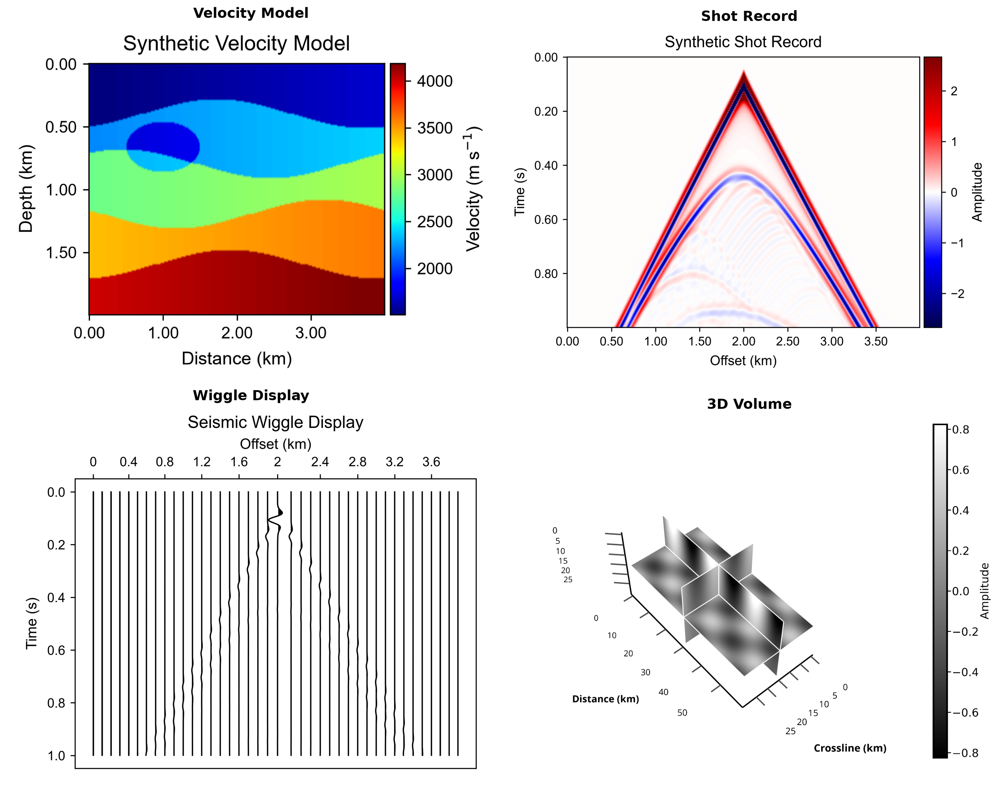

# Geophysics Forward Plotting

**面向 AI 编程代理的出版级地球物理绘图技能框架。**

Geophysics Forward Plotting 将地震正演建模研究中使用的绘图规约，打包为可移植的 Agent Skills 和可执行的 Python 代码。它帮助 AI 代理生成速度模型、炮集记录、波场快照、方法对比图、误差图、波形图、性能图表和三维体视图，同时保留物理坐标、单位、轴方向和共享色标归一化。

[English](README.md) | **中文**




本项目基于 [CIGVis](https://github.com/JintaoLee-Roger/cigvis) 构建。CIGVis 提供一维、二维、三维及交互式地球物理可视化能力；本仓库在此基础上添加了 Agent/Skills 框架、正演建模图表规约、任务路由、审查门控和导出规则。详见 [CIGVis Gallery](https://cigvis.readthedocs.io/en/latest/gallery/index.html)。

```text
  加载            检查            路由           绘图           审查           导出
 +------+      +--------+      +------+      +-------+      +------+      +--------+
 | 数据 | ---> | 形状   | ---> | 任务 | ---> | 技能  | ---> | 坐标 | ---> | PNG    |
 | YAML |      | 单位   |      | 类型 |      | 执行  |      | 色标 |      | PDF/SVG|
 +------+      +--------+      +------+      +-------+      +------+      +--------+
```

---

## 命令

`gfp` 命令行工具直接映射绘图代理工作流。

| 操作 | 命令 | 结果 |
|---|---|---|
| 渲染 YAML 任务 | `gfp render examples/configs/shot_record.yaml` | 生成图片文件及审查信息 |
| 查看执行计划 | `gfp plan examples/configs/compare_4methods.yaml` | 选定的技能及计划步骤 |
| 审查图表任务 | `gfp review examples/configs/wavefield_snapshot.yaml` | 仅返回规约检查结果，不渲染 |
| 列出可执行技能 | `gfp skills` | 已注册的 Python 技能 |
| 列出可移植 Agent Skills | `gfp agent-skills list` | 规范 `SKILL.md` 目录 |
| 验证 Agent Skills | `gfp agent-skills validate` | 前置信息及章节校验 |
| 安装技能到 AI 工具 | `gfp agent-skills install --tool all` | 项目本地技能副本 |

---

## 快速开始

<details open>
<summary><b>Conda 环境（推荐）</b></summary>

```bash
cd geophysics-forward-plotting
conda env create -f environment.yml
conda activate geophysics-forward-plotting
gfp agent-skills validate
gfp render examples/configs/shot_record.yaml
```

安装可选的 CIGVis 运行时以支持三维体渲染和 SliceViewer：

```bash
python -m pip install -e ".[cigvis-3d]"
python -m pip install -e ".[sliceviewer]"
```

</details>

<details>
<summary><b>已有 Python 3.11+ 环境</b></summary>

```bash
python -m pip install -e ".[plot,cli]"
python -m pip install -e ".[full]"  # 包含 CIGVis
```

</details>

<details>
<summary><b>国内镜像</b></summary>

```bash
conda create -n geophysics-forward-plotting python=3.11 \
  --override-channels \
  -c https://mirrors.tuna.tsinghua.edu.cn/anaconda/pkgs/main \
  -c https://mirrors.tuna.tsinghua.edu.cn/anaconda/cloud/conda-forge -y
conda activate geophysics-forward-plotting
python -m pip install -e ".[plot,dev]" \
  -i https://mirrors.tuna.tsinghua.edu.cn/pypi/web/simple
```

</details>

---

## 数据格式

Agent 和 CLI 统一通过 `data_paths` 支持以下格式：

| 格式 | 扩展名 | 行为 |
|---|---|---|
| NumPy | `.npy` | 禁用 pickle 读取 |
| 原始二进制 | `.bin` | 必须显式提供 shape，支持 dtype、端序、C/F 顺序和偏移 |
| SEG-Y | `.sgy`, `.segy` | 使用 `segyio`，默认转为 `(samples, traces)` |
| Seismic Unix | `.su` | 使用 `segyio.su`，保留采样间隔元数据 |

```yaml
# 原始 BIN：不允许猜测 shape
data_paths: [data/shot_record.bin]
data_options:
  shape: [2000, 240]
  dtype: float32
  endianness: little
  order: C
  data_layout: nt_nx
```

```yaml
# SEG-Y/SU 默认输出 (nt, nx)，dt 从头段读取并转换为秒
data_paths: [data/field_shot.segy]
data_options:
  output_layout: samples_traces
  ignore_geometry: true
  strict: false
```

多文件任务可以使用与 `data_paths` 一一对应的 `data_options` 列表；
单个 mapping 会共享给所有输入。3D SEG-Y 体数据必须在确认 trace 顺序后
显式提供 `shape: [nz, ny, nx]`。

---

## AI 编程工具集成

`skills/` 是唯一的规范目录。所有集成均指向同一套科学规约，避免为各产品重复编写提示词。

安装技能到一个或多个项目本地目录：

```bash
gfp agent-skills install --tool codex claude cursor gemini copilot opencode
```

| 工具 | 项目入口文件 | 安装目录 |
|---|---|---|
| OpenAI Codex | `AGENTS.md` | `.agents/skills/` |
| Claude Code | `CLAUDE.md` | `.claude/skills/` |
| Cursor | `.cursor/rules/` | `.cursor/skills/` |
| Gemini CLI | `GEMINI.md` | `.gemini/skills/` |
| GitHub Copilot | `.github/copilot-instructions.md` | `.github/skills/` |
| OpenCode | `AGENTS.md` | `.opencode/skills/` |
| Windsurf | `.windsurf/rules/` | 读取规范目录 |
| Cline | `.clinerules/` | 读取规范目录 |
| Roo Code | `.roo/rules/` | 读取规范目录 |

安装器不会覆盖已有技能，除非指定 `--force`。使用 `--destination PATH` 可将技能安装到其他项目。详见 [Agent Skills 集成文档](docs/agent-skills.md)。

---

## 全部 14 个 Agent Skills

目录包含一个根路由器、一个方法评估编排器、一个数据检查技能、九个绘图工作流和一个最终图件审查门控。代理仅加载当前任务所需的最小技能集。

### 编排 - 路由与评估

| 技能 | 功能 | 使用场景 |
|---|---|---|
| [geophysics-forward-plotting](skills/geophysics-forward-plotting/SKILL.md) | 将请求路由至检查、绘图、审查和导出流程 | 开始任何地球物理绘图任务时 |
| [method-evaluation](skills/method-evaluation/SKILL.md) | 组合对比、残差、性能和审查工作流 | 评估方法相对于参考结果或基准的表现时 |

### 检查 - 理解数据

| 技能 | 功能 | 使用场景 |
|---|---|---|
| [data-inspector](skills/data-inspector/SKILL.md) | 加载 NPY/BIN/SEG-Y/SU 并推断 `nt x nx`、`nz x nx`、`nz x ny x nx` 布局 | 格式、形状、端序、采样或物理轴不确定时 |

### 绘图 - 生成图件

| 技能 | 功能 | 使用场景 |
|---|---|---|
| [velocity-model-plotting](skills/velocity-model-plotting/SKILL.md) | 绘制速度模型，距离/深度坐标，深度向下 | 显示速度模型或单调空间场时 |
| [shot-record-plotting](skills/shot-record-plotting/SKILL.md) | 绘制炮集记录，时间向下，对称振幅范围 | 显示模拟或观测接收器记录时 |
| [wavefield-snapshot-plotting](skills/wavefield-snapshot-plotting/SKILL.md) | 绘制波场快照，对称范围，深度向下，可选时间标注 | 检查某一时间步的压力或位移场时 |
| [multi-method-comparison](skills/multi-method-comparison/SKILL.md) | 构建 2-4 个对齐面板，统一色域和共享色条 | 比较算法、分辨率或时间步时 |
| [wiggle-plotting](skills/wiggle-plotting/SKILL.md) | 创建波形显示，支持跳道、增益、缩放和填充控制 | 检查单道或局部炮集窗口时 |
| [error-map-plotting](skills/error-map-plotting/SKILL.md) | 创建带符号、绝对或相对误差图，正确设置颜色语义 | 量化与参考数组的偏差时 |
| [performance-plotting](skills/performance-plotting/SKILL.md) | 创建面向出版的运行时间、内存和加速比图表 | 报告计算基准测试结果时 |
| [volume-3d-plotting](skills/volume-3d-plotting/SKILL.md) | 将三维体切片和叠加委托给 CIGVis | 在三维中查看地震或波场数据体时 |
| [sliceviewer-plotting](skills/sliceviewer-plotting/SKILL.md) | 打开交互式 CIGVis SliceViewer 查看三维数组 | 探索 inline、crossline 和深度/时间切片时 |

### 审查 - 强制执行规约

| 技能 | 功能 | 使用场景 |
|---|---|---|
| [figure-review](skills/figure-review/SKILL.md) | 检查单位、轴方向、色条标签、共享归一化、标题长度、布局和导出 DPI | 接受或导出任何研究图件前 |

---

## 使用方法

### Python API

```python
from pathlib import Path

import numpy as np

from geophysics_forward_plotting import FigureTask, PlottingAgent
from geophysics_forward_plotting.core.models import DataContext

shot = np.load("examples/data/shot_record.npy")

task = FigureTask(
    task_type="shot_record",
    title="合成炮集记录",
    output_dir=Path("examples/outputs"),
    dx=0.025,
    dt=0.002,
    x_label="接收器位置 (km)",
    y_label="时间 (s)",
    colorbar_label="振幅",
    symmetric_clim=True,
    dpi=600,
    export_formats=("png", "pdf"),
)

result = PlottingAgent().run(task, DataContext(raw_data=(shot,)))
print(*result.saved_paths, sep="\n")
print(*result.review_messages, sep="\n")
```

### YAML 与 CLI

```yaml
task_type: shot_record
title: 合成炮集记录
data_paths:
  - examples/data/shot_record.npy
output_dir: examples/outputs
dx: 0.025
dt: 0.002
x_label: 接收器位置 (km)
y_label: 时间 (s)
colorbar_label: 振幅
symmetric_clim: true
dpi: 600
export_formats: [png, pdf]
```

```bash
gfp plan examples/configs/shot_record.yaml
gfp render examples/configs/shot_record.yaml
gfp review examples/configs/shot_record.yaml
```

生成的图片输出到 `examples/outputs/`。仓库在 `examples/data/` 下包含小型模拟数组，二维示例可直接运行。

---

## CIGVis 优先渲染

[CIGVis](https://github.com/JintaoLee-Roger/cigvis) 是可视化基础；`CIGVisBackend` 是轻量接口适配器，而非重新实现。

| 工作负载 | 主要后端 | 回退行为 |
|---|---|---|
| 地震图像、切片和道集 | CIGVis 优先 | CIGVis 不可用时 Matplotlib 可用于二维渲染 |
| 运行时间、内存和加速比图表 | Matplotlib | Matplotlib 是预期后端 |
| 三维体、断层、层位、井、点 | CIGVis | 抛出明确的依赖/运行时错误，不静默回退 |
| 交互式 SliceViewer | CIGVis | 抛出明确的依赖/运行时错误，不静默回退 |

更多三维叠加、任意测线、井曲线、地质体、点云和浏览器渲染功能，请参阅 [CIGVis Gallery](https://cigvis.readthedocs.io/en/latest/gallery/index.html)。适配器接受数组、NPY/BIN/SEG-Y/SU 路径和 YAML 任务配置，不依赖硬编码的 CIGVis 示例路径。

---

## 技能工作原理

每个可移植技能具有一致的入口点和渐进式披露布局：

```text
skills/<skill-name>/
  SKILL.md
    frontmatter       -> 名称和触发描述
    Purpose           -> 科学目标
    When to Use       -> 路由条件
    Inputs / Outputs  -> 所需数据和产出物
    Conventions       -> 物理轴、单位和颜色语义
    Workflow          -> 有序执行步骤
    Mistakes          -> 需要拒绝的失败模式
    Verification      -> 完成前所需的证据
  agents/openai.yaml  -> 可选的产品元数据
```

**核心设计原则：**

- **过程而非说明。** 技能定义了带有检查点和退出条件的可执行工作流，而非通用的绘图提示词。
- **物理优先于外观。** 物理坐标、单位、轴方向、颜色语义和对比公平性是强制要求。
- **CIGVis 优先。** 适配和组合现有的地球物理渲染原语，而非重新实现。
- **确定性审查。** Python `FigureReviewSkill` 在文本技能引导编程代理后，对结果进行检查。
- **渐进式披露。** 代理仅在需要时加载根路由器、一个专业技能和相关参考。

文本技能引导 Codex、Claude、Cursor、Gemini、Copilot 等代理。`src/geophysics_forward_plotting/skills/` 下的类为相同的领域规则提供确定性执行。

---

## 科学绘图规约

| 图表类型 | 强制默认值 |
|---|---|
| 速度模型 | 距离单位 km，深度单位 km，深度向下，`Velocity (m/s)` 色条 |
| 炮集记录 | 接收器距离单位 km，时间单位 s，时间向下，对称振幅范围 |
| 波场快照 | 距离/深度坐标轴，深度向下，对称振幅范围，已知时标注快照时间 |
| 多方法对比 | 相同坐标范围，统一色图，全局 `clim`，共享色条 |
| 带符号误差 | 发散色图，以零为中心；记录定义 |
| 绝对误差 | 顺序色图，从零开始 |
| 相对误差 | 明确说明公式和稳定化 epsilon |
| 性能 | 明确指标单位和基准 |
| 导出 | PNG 默认出版 DPI；支持 PDF/SVG 矢量输出 |

完整规约详见 [地球物理绘图规约](docs/conventions.md)。

---

## 示例

| 工作流 | 脚本 | 示例输出 |
|---|---|---|
| 生成模拟数据 | `gfp data examples/data` | `examples/data/*.npy` |
| 速度模型 | [demo_velocity_model.py](examples/scripts/demo_velocity_model.py) | `examples/outputs/velocity_model.png` |
| 炮集记录 | [demo_shot_record.py](examples/scripts/demo_shot_record.py) | `examples/outputs/shot_record.png` |
| 波场快照 | [demo_wavefield_snapshot.py](examples/scripts/demo_wavefield_snapshot.py) | `examples/outputs/wavefield_snapshot.png` |
| 四方法对比 | [demo_compare_4methods.py](examples/scripts/demo_compare_4methods.py) | `examples/outputs/multi_method_compare.png` |
| 波形显示 | [demo_wiggle.py](examples/scripts/demo_wiggle.py) | `examples/outputs/wiggle.png` |
| 误差图 | [demo_error_map.py](examples/scripts/demo_error_map.py) | `examples/outputs/error_map_signed.png` |
| 性能图表 | [demo_performance.py](examples/scripts/demo_performance.py) | `examples/outputs/performance.png` |
| 三维体 | [demo_volume_3d.py](examples/scripts/demo_volume_3d.py) | 交互式 CIGVis 窗口 |
| SliceViewer | [demo_sliceviewer.py](examples/scripts/demo_sliceviewer.py) | 交互式 CIGVis 查看器 |
| 完整正演工作流 | [demo_full_workflow.py](examples/scripts/demo_full_workflow.py) | `examples/outputs/forward/` |

---

## 项目结构

```text
geophysics-forward-plotting/
|-- skills/                              # 14 个规范 Agent Skills
|   |-- geophysics-forward-plotting/     # 根路由器
|   |-- method-evaluation/               # 评估编排器
|   |-- data-inspector/                  # 数据布局推断
|   `-- .../SKILL.md                     # 绘图和审查技能
|-- src/geophysics_forward_plotting/
|   |-- agent/                           # 路由器、规划器、PlottingAgent
|   |-- skills/                          # 可执行 Python 技能
|   |-- backend/                         # CIGVis 和 Matplotlib 适配器
|   |-- core/                            # 任务、上下文、结果、验证
|   `-- cli/                             # gfp 命令行
|-- examples/
|   |-- data/                            # 小型可运行 NumPy 数组
|   |-- configs/                         # YAML 任务配置
|   |-- scripts/                         # 每种图表类型的演示脚本
|   `-- outputs/                         # 生成的图件预览
|-- docs/                                # 架构和规约文档
|-- tests/                               # 59 个自动化测试
|-- AGENTS.md / CLAUDE.md / GEMINI.md    # AI 工具入口点
|-- environment.yml                      # Conda 环境
`-- pyproject.toml                       # 包和可选依赖
```

---

## 为什么需要 Agent Skills？

通用编程代理通常能生成视觉上合理的图表，却忽略了决定其是否具有科学依据的细节：时间轴方向向上、振幅面板独立归一化、坐标轴显示采样索引、误差图省略其定义公式。

这些技能将领域判断转化为明确的工作流和验证门控。代理知道何时使用 CIGVis、需要请求哪些元数据、哪些归一化必须共享，以及在宣布图表达到出版标准前需要哪些证据。

---

## 路线图

- 更丰富的 CIGVis 断层、层位、井曲线和点云适配器。
- 面向对比的 SliceViewer 布局，支持真实和合成数据并排。
- 包含输入哈希和渲染参数的图件溯源清单。
- 期刊风格模板和自动面板编号。
- 随 AI 编程工具标准化技能发现而增加更多代理适配器。

---

## 贡献指南

新增图表类型应是一条聚焦的工作流，包含配套的文本技能和代码：

1. 添加 `skills/<name>/SKILL.md`，包含触发条件、规约、失败模式、工作流和验证证据。
2. 在 `src/geophysics_forward_plotting/skills/` 下实现 `BaseSkill` 子类。
3. 在默认 `SkillRegistry` 中注册。
4. 添加 YAML 配置、可运行示例和聚焦测试。
5. 验证完整仓库：

```bash
conda activate geophysics-forward-plotting
gfp agent-skills validate
pytest
ruff check .
```

技能应专注、地球物理上正确、可验证，且足够精简，以便代理仅在任务需要时加载。

---

## 致谢

- [CIGVis](https://github.com/JintaoLee-Roger/cigvis) 提供底层地球物理可视化系统和画廊模式。
- 目录组织和面向过程的技能呈现方式受 [addyosmani/agent-skills](https://github.com/addyosmani/agent-skills) 启发。

## 许可证

MIT - 详见 [LICENSE](LICENSE)。
